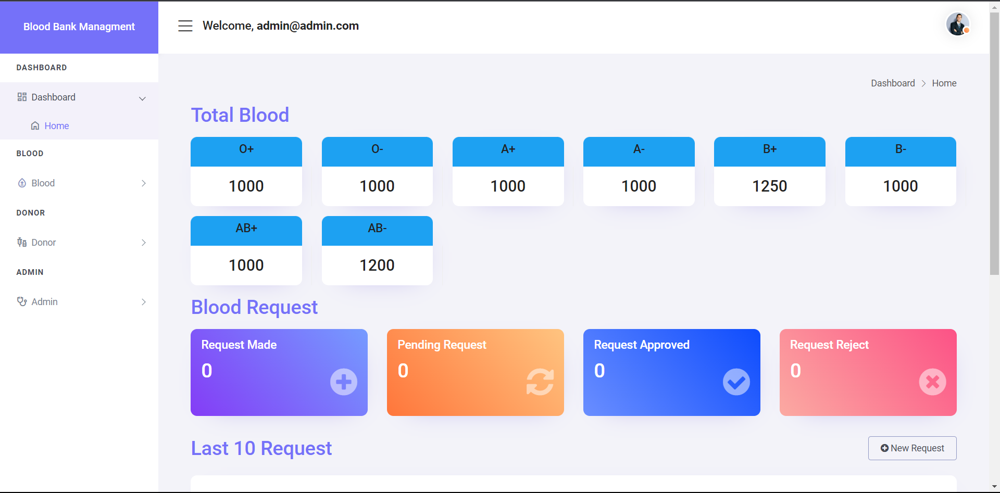
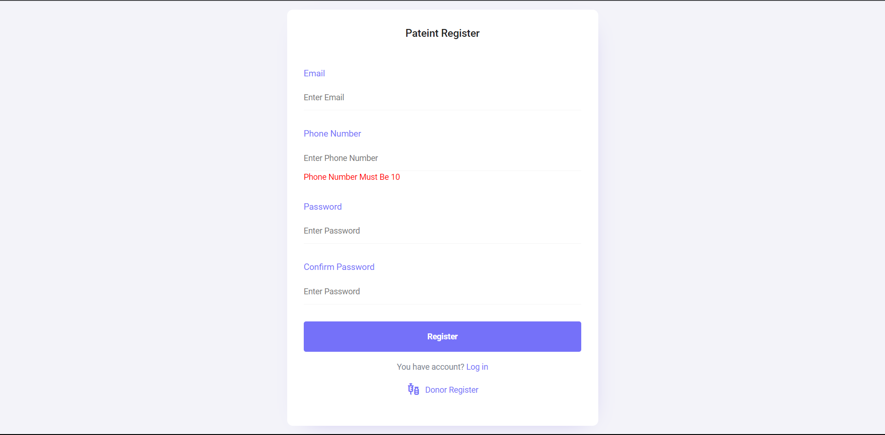
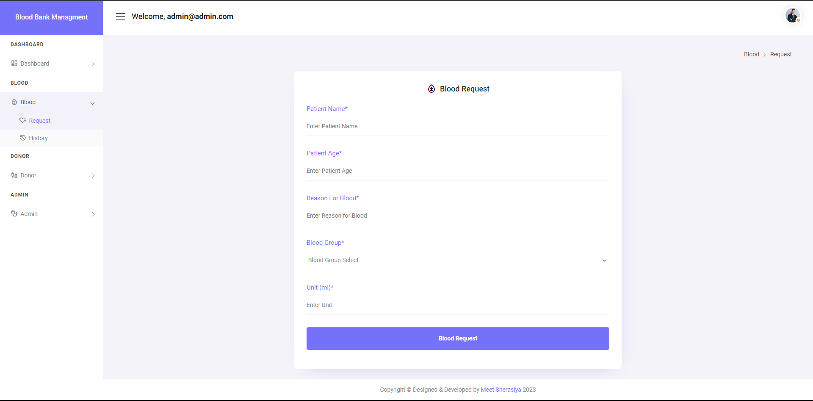
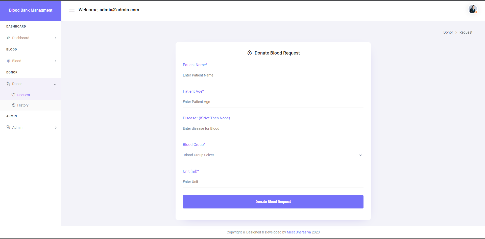
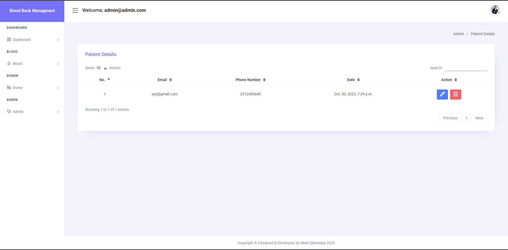
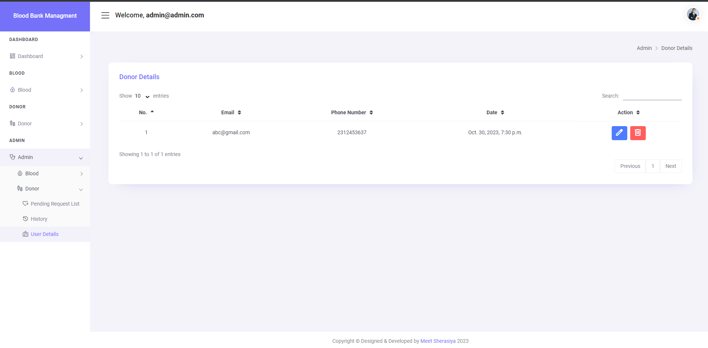

# 🩸 Khoonn: Blood Bank Management System

**Khoonn** is a comprehensive, secure, and user-friendly Blood Bank Management System designed to streamline blood donation, request processing, and inventory management. It connects donors, patients, and administrators on a single, intuitive platform.

---

## 📑 Table of Contents
- [✨ Key Features](#-key-features)
- [💻 Tech Stack](#-tech-stack)
- [🚀 Setup & Installation](#-setup--installation)
- [🔑 Default Admin Credentials](#-default-admin-credentials)
- [📸 Application Screenshots](#-application-screenshots)
- [🛡️ Security Note](#️-security-note)

---

## ✨ Key Features

### 👤 User & Patient Features
- **Secure Registration & Authentication**: Role-based access control for Patients, Donors, and Administrators.
- **Personalized Dashboard**: Overview of previous donation history, pending requests, and status updates.
- **Blood Requests**: Create and track requests for specific blood types with real-time status updates.

### 🩸 Donor Features
- **Donation Submission**: Easily submit and update blood donation details.
- **Donation History**: Track and view a complete history of past donations and impact.

### 🛡️ Administrator Features
- **Centralized Admin Dashboard**: High-level overview of pending requests, active donations, and overall system health.
- **Request Management**: Approve or reject blood requests with a single click.
- **Inventory Management**: Manage available blood units, update stock levels, and track expiration dates to prevent wastage.

---

## 💻 Tech Stack
- **Backend**: Python, Django
- **Frontend**: HTML5, CSS3, JavaScript, Bootstrap
- **Database**: SQLite (Development) / PostgreSQL (Production)
- **Environment**: Python Virtual Environment (`venv`)

---

## 🚀 Setup & Installation

Follow these steps to get a local development copy up and running.

### 1. Clone the Repository
```sh
git clone https://github.com/subingaire-bit/Khoonn.git
cd Khoonn
```

### 2. Create and Activate a Virtual Environment
*Recommended: Use the built-in Python `venv` module for a modern, clean setup.*
```sh
python -m venv env
```
- **On macOS/Linux**:
  ```sh
  source env/bin/activate
  ```
- **On Windows**:
  ```sh
  env\Scripts\activate
  ```

### 3. Install Dependencies
```sh
pip install -r requirements.txt
```

### 4. Apply Database Migrations
```sh
python manage.py migrate
```

### 5. Run the Development Server
```sh
python manage.py runserver
```
The application will now be available at `http://127.0.0.1:8000/`

---

## 🔑 Default Admin Credentials

Use these credentials to access the administrator dashboard. 

| Role | Email | Password |
| :--- | :--- | :--- |
| **Admin** | `admin@admin.com` | `admin@1234` |

> ⚠️ **Security Note**: *Please change the default admin password immediately after your first login in any production or staging environment.*

---

## 📸 Application Screenshots

| Page | Preview |
| :--- | :---: |
| **Dashboard** |  |
| **Patient Registration** |  |
| **Donor Registration** |  |
| **Patient Blood Request** |  |
| **Donor Donation Request** |  |
| **Patient Details** |  |
| **Donor Details** |  |

---

## 🤝 Contributing
Contributions are what make the open-source community such an amazing place to learn, inspire, and create. Any contributions you make are **greatly appreciated**.
1. Fork the Project
2. Create your Feature Branch (`git checkout -b feature/AmazingFeature`)
3. Commit your Changes (`git commit -m 'Add some AmazingFeature'`)
4. Push to the Branch (`git push origin feature/AmazingFeature`)
5. Open a Pull Request

---

## 📄 License
Distributed under the MIT License. See `LICENSE` for more information.